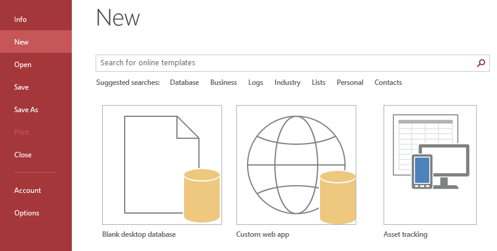
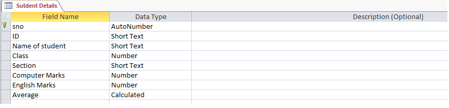
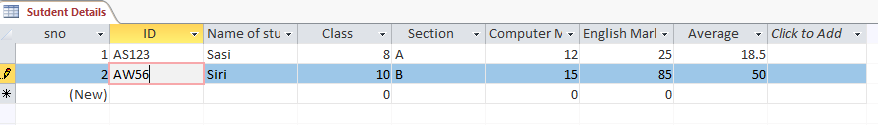
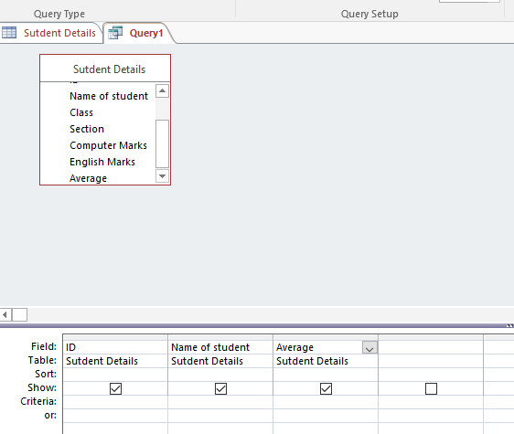

# MS-Access Practical with tables and queries

## How to create a table in MS-Access?
- Create a new database
- A new database is created with an empty table
- Open the create tab and click on the table option
- Open the design view and start adding the field names and their respective data types
- Switch to data sheet view and start inputting the data into the table and save it with a name
### Design View

### Data Sheet View

## How to create a query in MS-Access?
- Create a que using the create tab and click on query design.
- Select the record source, it can be both a table and another query
- The design grid is opened and the fields are selected.

