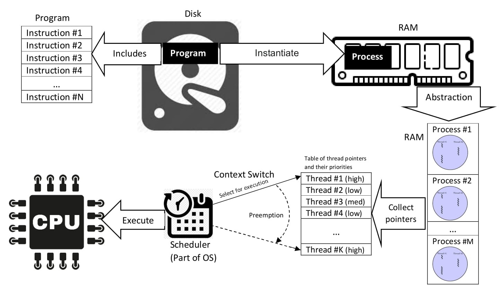
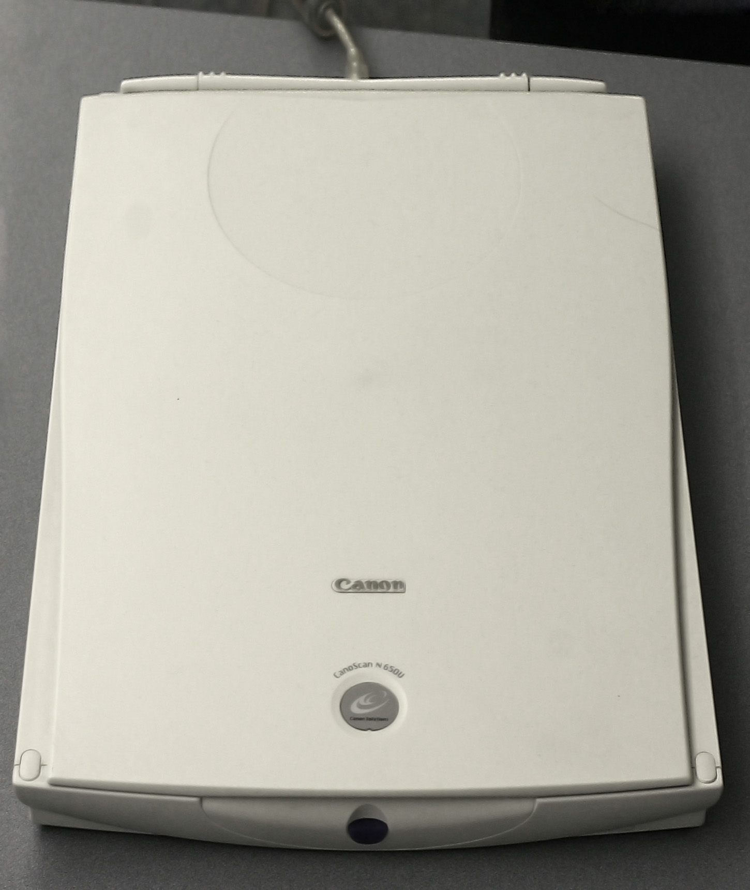
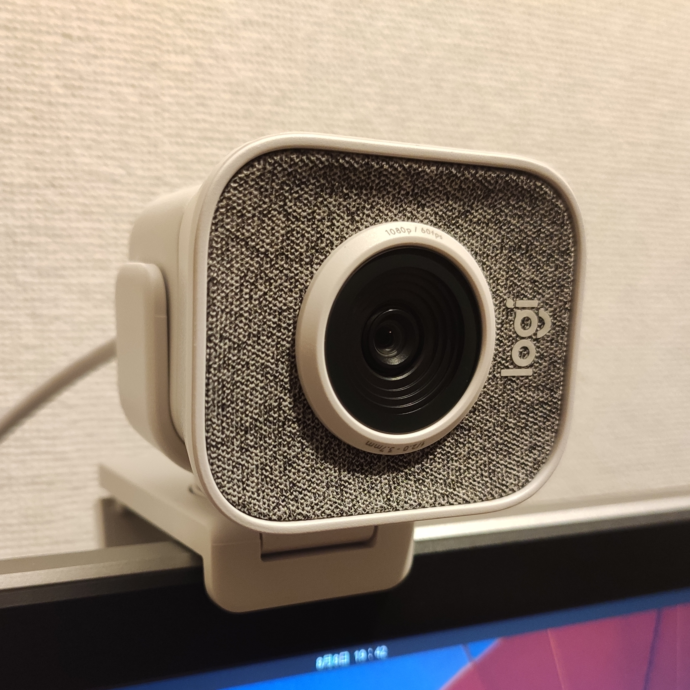
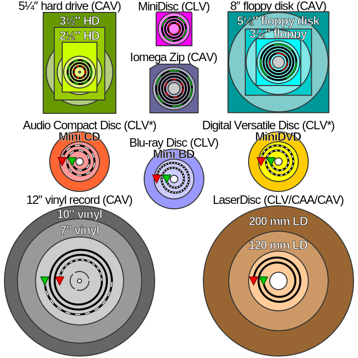

# Hardware Components

The physical components of a computer that you can touch and feel are known as **hardware**.

**Software** is a set of programs that instructs a computer about the work to be done.

## Internal Hardware

### Motherboard

A printed circuit board in general purpose computers,holds and allows communication between many crucial electrical components.

### CPU - Central Processing Unit

Electronic circuitry that executes instructions.

The CPU performs basic arithmetic, logic, controlling, and input/output (I/O) operations specified by the instructions in the program.

### RAM

Random-access memory is a form of computer memory that can be read and changed in any order, typically used to store working data and machine code.

A random-access memory device allows data items to be read or written in almost the same amount of time irrespective of the physical location of data inside the memory, in contrast with other direct-access data storage media (such as hard disks, CD-RWs, DVD-RWs and the older magnetic tapes and drum memory), where the time required to read and write data items varies significantly depending on their physical locations on the recording medium, due to mechanical limitations such as media rotation speeds and arm movement.

### ROM

Read-only memory (ROM) is a type of non-volatile memory used in computers and other electronic devices. Data stored in ROM cannot be electronically modified after the manufacture of the memory device. Read-only memory is useful for storing software that is rarely changed during the life of the system, also known as firmware.

### Disk Drive

Disk storage (also sometimes called drive storage) is a general category of storage mechanisms where data is recorded by various electronic, magnetic, optical, or mechanical changes to a surface layer of one or more rotating disks. A disk drive is a device implementing such a storage mechanism. Notable types are the hard disk drive (HDD) containing a non-removable disk, the floppy disk drive (FDD) and its removable floppy disk, and various optical disc drives (ODD) and associated optical disc media.

### Hard Disk

A hard disk drive (HDD), hard disk, hard drive, or fixed disk, is an electro-mechanical data storage device that stores and retrieves digital data using magnetic storage with one or more rigid rapidly rotating platters coated with magnetic material. The platters are paired with magnetic heads, usually arranged on a moving actuator arm, which read and write data to the platter surfaces. Data is accessed in a random-access manner, meaning that individual blocks of data can be stored and retrieved in any order. HDDs are a type of non-volatile storage, retaining stored data when powered off.

### SMPS

A switched-mode power supply (switching-mode power supply, switch-mode power supply, switched power supply, SMPS, or switcher) is an electronic power supply that incorporates a switching regulator to convert electrical power efficiently.

Like other power supplies, an SMPS transfers power from a DC or AC source (often mains power, see AC adapter) to DC loads, such as a personal computer, while converting voltage and current characteristics. Unlike a linear power supply, the pass transistor of a switching-mode supply continually switches between low-dissipation, full-on and full-off states, and spends very little time in the high dissipation transitions, which minimizes wasted energy. A hypothetical ideal switched-mode power supply dissipates no power. Voltage regulation is achieved by varying the ratio of on-to-off time (also known as duty cycles). In contrast, a linear power supply regulates the output voltage by continually dissipating power in the pass transistor. The switched-mode power supply's higher electrical efficiency is an important advantage.

### Modem

A modulator-demodulator or modem is a computer hardware device that converts data from a digital format into a format suitable for an analog transmission medium such as telephone or radio. A modem transmits data by modulating one or more carrier wave signals to encode digital information, while the receiver demodulates the signal to recreate the original digital information. The goal is to produce a signal that can be transmitted easily and decoded reliably. Modems can be used with almost any means of transmitting analog signals, from light-emitting diodes to radio.

#### Internal Modem

#### External Modem

### Heat Sink

A heat sink (also commonly spelled heatsink) is a passive heat exchanger that transfers the heat generated by an electronic or a mechanical device to a fluid medium, often air or a liquid coolant, where it is dissipated away from the device, thereby allowing regulation of the device's temperature.

### Ports

In computer hardware, a port serves as an interface between the computer and other computers or peripheral devices. In computer terms, a port generally refers to the part of a computing device available for connection to peripherals such as input and output devices. Computer ports have many uses, to connect a monitor, webcam, speakers, or other peripheral devices. On the physical layer, a computer port is a specialized outlet on a piece of equipment to which a plug or cable connects. Electronically, the several conductors where the port and cable contacts connect, provide a method to transfer signals between devices.

## External Hardware

### Keyboard

A computer keyboard is a peripheral input device modeled after the typewriter keyboard which uses an arrangement of buttons or keys to act as mechanical levers or electronic switches

### Mouse

A computer mouse is a hand-held pointing device that detects two-dimensional motion relative to a surface. This motion is typically translated into the motion of a pointer on a display, which allows a smooth control of the graphical user interface of a computer.

### Scanner

An image scanner—often abbreviated to just scanner—is a device that optically scans images, printed text, handwriting or an object and converts it to a digital image.

### Microphone

A microphone is a transducer that converts sound into an electrical signal.

A transducer is a device that converts energy from one form to another. Usually a transducer converts a signal in one form of energy to a signal in another. Transducers are often employed at the boundaries of automation, measurement, and control systems, where electrical signals are converted to and from other physical quantities (energy, force, torque, light, motion, position, etc.). The process of converting one form of energy to another is known as transduction

### Light pen

A light pen is a computer input device in the form of a light-sensitive wand used in conjunction with a computer's cathode-ray tube (CRT) display.

It allows the user to point to displayed objects or draw on the screen in a similar way to a touchscreen but with greater positional accuracy.

### Digital Camera

Digital and digital movie cameras share an optical system, typically using a lens with a variable diaphragm to focus light onto an image pickup device. The diaphragm and shutter admit a controlled amount of light to the image, just as with film, but the image pickup device is electronic rather than chemical.

### Web Camera

A webcam is a video camera which is designed to record or stream to a computer or computer network. They are primarily used in videotelephony, livestreaming and social media, and security. Webcams can be built-in computer hardware or peripheral devices, and are commonly connected to a device using USB or wireless protocols.

### Monitor

A computer monitor is an output device that displays information in pictorial or textual form. A discrete monitor comprises a visual display, support electronics, power supply, housing, electrical connectors, and external user controls.

### Printer

In computing, a printer is a peripheral machine which makes a persistent representation of graphics or text, usually on paper.

### Projector

A projector or image projector is an optical device that projects an image (or moving images) onto a surface, commonly a projection screen. Most projectors create an image by shining a light through a small transparent lens, but some newer types of projectors can project the image directly, by using lasers. A virtual retinal display, or retinal projector, is a projector that projects an image directly on the retina instead of using an external projection screen.

### Plotter

A plotter is a machine that produces vector graphics drawings. Plotters draw lines on paper using a pen, or in some applications, use a knife to cut a material like vinyl or leather. In the latter case, they are sometimes known as a cutting plotter.

In the past, plotters were used in applications such as computer-aided design, as they were able to produce line drawings much faster and of a higher quality than contemporary conventional printers. Smaller desktop plotters were often used for business graphics. Printers with graphics capabilities took away some of the market by the early 1980s, and the introduction of laser printers in the mid-1980s largely eliminated the use of plotters from most roles.

Digitally controlled plotters evolved from earlier fully analog XY-writers used as output devices for measurement instruments and analog computers.

Pen plotters print by moving a pen or other instrument across the surface of a piece of paper. This means that plotters are vector graphics devices, rather than raster graphics as with other printers. Pen plotters can draw complex line art, including text, but do so slowly because of the mechanical movement of the pens. They are often incapable of efficiently creating a solid region of color, but can hatch an area by drawing a number of close, regular lines.

Plotters offered the fastest way to efficiently produce very large drawings or color high-resolution vector-based artwork when computer memory was very expensive and processor power was very limited, and other types of printers had limited graphic output capabilities.

Pen plotters have essentially become obsolete, and have been replaced by large-format inkjet printers and LED toner-based printers. Such devices may still understand vector languages originally designed for plotter use, because in many uses, they offer a more efficient alternative to raster data.

### CD

The compact disc (CD) is a digital optical disc data storage format that was co-developed by Philips and Sony to store and play digital audio recordings.

The format was later adapted (as CD-ROM) for general-purpose data storage. Several other formats were further derived, including write-once audio and data storage (CD-R), rewritable media (CD-RW), Video CD (VCD), Super Video CD (SVCD), Photo CD, Picture CD, Compact Disc-Interactive (CD-i) and Enhanced Music CD.

Standard CDs have a diameter of 120 millimetres (4.7 in) and are designed to hold up to 74 minutes of uncompressed stereo digital audio or about 650 MiB of data. Capacity is routinely extended to 80 minutes and 700 MiB by arranging data more closely on the same sized disc. The Mini CD has various diameters ranging from 60 to 80 millimetres (2.4 to 3.1 in); they are sometimes used for CD singles, storing up to 24 minutes of audio, or delivering device drivers.

### DVD

The DVD (common abbreviation for Digital Video Disc or Digital Versatile Disc)[8][9] is a digital optical disc data storage format. It was invented and developed in 1995 and first released on November 1, 1996, in Japan. The medium can store any kind of digital data and has been widely used for video programs (watched using DVD players) or formerly for storing software and other computer files as well. DVDs offer significantly higher storage capacity than compact discs (CD) while having the same dimensions. A standard DVD can store up to 4.7 GB of storage, while variants can store up to a maximum of 17.08 GB.

### Blu Ray Disk

The Blu-ray Disc (BD), often known simply as Blu-ray, is a digital optical disc data storage format. It was invented and developed in 2005 and released on June 20, 2006 worldwide. It is designed to supersede the DVD format, and capable of storing several hours of high-definition video (HDTV 720p and 1080p). The main application of Blu-ray is as a medium for video material such as feature films and for the physical distribution of video games for the PlayStation 3, PlayStation 4, PlayStation 5, Xbox One, and Xbox Series X. The name "Blu-ray" refers to the blue laser (which is actually a violet laser) used to read the disc, which allows information to be stored at a greater density than is possible with the longer-wavelength red laser used for DVDs.

The polycarbonate disc is 120 millimetres (4.7 in) in diameter and 1.2 millimetres (0.047 in) thick, the same size as DVDs and CDs. Conventional or pre-BD-XL Blu-ray Discs contain 25 GB per layer, with dual-layer discs (50 GB) being the industry standard for feature-length video discs. Triple-layer discs (100 GB) and quadruple-layer discs (128 GB) are available for BD-XL re-writer drives.

High-definition (HD) video may be stored on Blu-ray Discs with up to 1920×1080 pixel resolution, at 24& 50/60 progressive or 50/60 interlaced frames per second. DVD discs were limited to a maximum resolution of 480 (NTSC, 720×480 pixels) or 576 lines (CCIR 625/50, 720×576 pixels, commonly used with PAL). Besides these hardware specifications, Blu-ray is associated with a set of multimedia formats.

### Pen Drive

A USB flash drive is a data storage device that includes flash memory with an integrated USB interface. It is typically removable, rewritable and much smaller than an optical disc.

Flash memory is an electronic non-volatile computer memory storage medium that can be electrically erased and reprogrammed.

As of March 2016, flash drives with anywhere from 8 to 256 gigabytes (GB) were frequently sold, while 512 GB and 1 terabyte (TB) units were less frequent.

As of 2018, 2 TB flash drives were the largest available in terms of storage capacity.

Some allow up to 100,000 write/erase cycles, depending on the exact type of memory chip used, and are thought to physically last between 10 and 100 years under normal circumstances.
